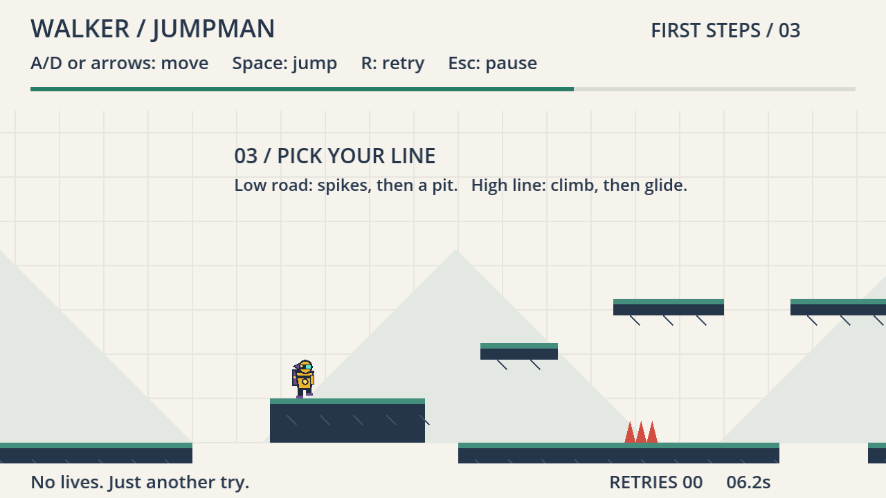
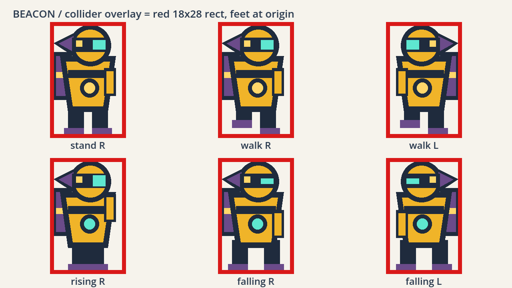
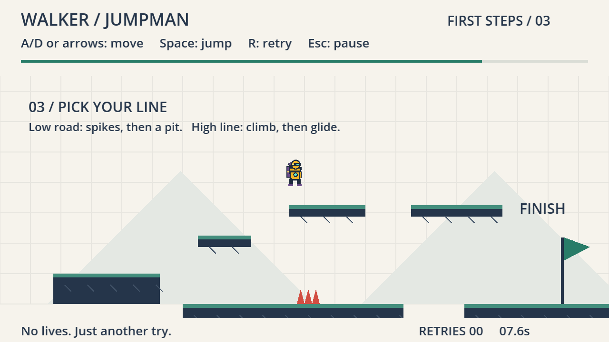

# walker-jumpman-zhaohui-li

**An extension of the walker-jumpman "First Steps" starter.** New character, new final zone.
Godot 4.7.2 / GDScript. Source-only; no export, no hosted build.

> **Starter credit.** This project extends **walker-jumpman** by **Nik Bear Brown** —
> https://github.com/nikbearbrown/walker-jumpman. The starter is recorded in this repository's
> history as commit `7f412c8`, *unmodified*, so everything after that commit is a readable diff
> of my own work. The starter's design package and its 2026-09-10 test receipts are kept as
> received. Full provenance in [SOURCES.md](SOURCES.md).



---

## Run it

Requires **Godot 4.7.2** (tested on `4.7.2.stable.official.ed1daf0bf`). No .NET runtime, no
external assets, no export templates.

Import `godot/project.godot` in the Godot editor and press Play, or from the repository root:

```bash
godot --path godot
```

On macOS you can also double-click [walker-jumpman.command](walker-jumpman.command) (inherited
from the starter; not re-verified on Windows).

## Controls

Unchanged from the starter.

| Key | Action |
|---|---|
| **Enter** | Start / resume / play again |
| **A / D**, **← / →** | Move |
| **Space** | Jump (one jump, no double jump) |
| **R** | Retry the attempt |
| **Esc** or **P** | Pause |
| **M** | Main menu (from pause or completion) |

Retries are unlimited and automatic after a death, about 0.55 s.

---

## What I changed

### A new character — BEACON

A signal-courier automaton replaces the starter's blue rectangle figure. The change is in
silhouette, not palette: a **domed head** instead of a flat-topped box, a **visor band with a
single cyan eye slot**, and a **cargo pack plus a swept fin** that both ride the trailing side
and flip across the body when you turn — so which way BEACON faces reads from the outline alone
at 18 pixels wide.



*Fixture render, not gameplay: six poses side by side with the exact 18×28 collider overlaid.*

Readable states: facing left/right, standing, walking, rising, falling. Legs close together on
the way up and brace apart on the way down; the visor slot squints while falling; the chest lamp
turns cyan only while airborne.

**Nothing about the body changed.** This is a `_draw()` rewrite. `tuning.gd` (all eight
values), the 18 × 28 collider, the collision layers and `_physics_process` are untouched, and
the `low-ceiling` check still reports `300.000274658203` exactly as it did before the swap.
Every drawn pixel stays inside the collider in every state — with one deliberate inward
exception documented in [TEST-REPORT.md](TEST-REPORT.md#character-appearance): while *grounded*
and walking, the stride lifts a boot up to 2 px off the floor line, never while airborne.

### A new final zone — 03 / PICK YOUR LINE

The level widens from **960 to 1600** and the finish moves from **x=916 to x=1548**, so the
original route alone can no longer win. Zones 01–02 are byte-identical in the level data and
still walkable.



A jump across a 56 px gap lands you on a **fork pad**, where the level splits:

- **Low road** — drop right and run. A spike cluster you must jump at speed, then a 64 px pit
  before the finish pad. Fast, flat targets, two real consequences.
- **High line** — climb a step and two ledges, no hazard at all, but three jumps onto elevated
  targets. It pays off at the end: the last ledge overhangs the finish pad, so you finish by
  running off the edge instead of jumping.

The trade-off is **hazard exposure versus jump precision**, and it is close to even: the two
lines complete in 562 and 565 ticks, a difference of 0.05 s. The choice is reversible — 32 px
back up onto the fork pad — because a fork that punishes curiosity is a bad fork.

Four new landings require jumps (fork pad, step, two high ledges), plus the finish pad across
the pit.

### Presentation, because moving data does not move the picture

The starter hard-codes several drawing coordinates that the level JSON does not control. Extending
the level forced these to become data-driven, or the new zone would have been painted wrong:

- backdrop rect, grid extent and hill positions now derive from `level.width` / `level.hills`
- spike baseline and tip come from the hazard rect instead of a literal `y = 320`
- the flag pole stands on the finish rect's bottom instead of a literal `y = 320`
- zone labels moved into the level JSON
- the HUD progress bar derives its span from spawn → finish instead of the constant `852`
  (which would have pegged at 100% the moment you entered the new zone)

---

## Verification

**31 mechanics checks / 0 failures** and **9 keyboard checks / 0 failures** on
`4.7.2.stable.official.ed1daf0bf`.

```bash
godot --headless --path godot --script res://tests/test_game.gd
```

```bash
godot --headless --path godot --script res://tests/test_keyboard.gd
```

The starter's 25 checks are all still present and still passing at their original tolerances.
Six were added, including `low-road-jump-not-clipped-by-high-line`, which pins a real bug found
while building this — an early draft stacked the two routes and the low road's jump clipped the
ledge overhead, cutting a 56 px jump to 17 px. Both fork lines are verified to reach the flag
with zero deaths.

No assertion was deleted and no expected value weakened to obtain a green report. The runs that
failed are kept in `evidence/` alongside the ones that passed.

Full results, the baseline captured before any edit, and three documented inspect-and-revise
cycles: **[TEST-REPORT.md](TEST-REPORT.md)**.

---

## Known limitations

1. **No human playtest recorded yet.** Every playability claim here is machine evidence only
   until [TEST-REPORT §5](TEST-REPORT.md) and [FRICTIONAL §9](FRICTIONAL.md) are filled in.
   An automated input route proves geometry is reachable, not that a level is any good.
2. **The explainer film is not produced.** The required Brutalist `godot-walkthrough` skill is
   not installed on this machine and has been requested; see [SOURCES.md §6](SOURCES.md).
   `film/` holds the beat sheet and script prepared for it.
3. **The fork-pad entry jump is the tightest input in the level** — roughly a 46 px run-up
   window (≈0.29 s). That figure is calculated, not measured.
4. **Nothing checks label placement.** One label overlapped the jump arc in a first render; it
   was caught by looking at a screenshot, and a future edit could reintroduce it with all tests
   still green.
5. **Windows only.** The starter reports macOS results; the macOS launcher is not re-verified.
6. No cherries, no audio, no settings/remapping, no moving platforms, no Web export — all out of
   scope here, as in the starter.

---

## Documents

| File | What it is |
|---|---|
| [CHANGE-BRIEF.md](CHANGE-BRIEF.md) | Predictions, written before implementation and not rewritten since |
| [TEST-REPORT.md](TEST-REPORT.md) | Baseline, every run including the failures, and the revision cycles |
| [FRICTIONAL.md](FRICTIONAL.md) | Honest log: what was tried, what broke, what I checked, human vs AI |
| [SOURCES.md](SOURCES.md) | Starter credit, asset provenance, tools, contribution split |
| [SUBMISSION.md](SUBMISSION.md) | Canvas submission note |
| [film/](film/) | Beat sheet, narration script, evidence index for the explainer |

Starter documentation, retained as received: [GAME-BRIEF](GAME-BRIEF.md) · [GDD](GDD.md) ·
[LEVEL-DESIGN](LEVEL-DESIGN.md) · [PRODUCTION-PLAN](PRODUCTION-PLAN.md) ·
[PLAYTEST-PLAN](PLAYTEST-PLAN.md) · [ASSET-PLAN](ASSET-PLAN.md) ·
[DESIGN-REVIEW](DESIGN-REVIEW.md) · [BUILD-REPORT](BUILD-REPORT.md) ·
[DESIGN-STATUS](DESIGN-STATUS.json)

---

## Final film

**Not yet rendered** — blocked on the Brutalist `godot-walkthrough` skill (see
[SOURCES.md §6](SOURCES.md)). When it exists, this section will carry:

- Film URL (course media storage, not this repository)
- Exact filename
- SHA-256 checksum
- The game-source commit the film demonstrates

MP3, MP4 and files over 25 MB are excluded from this repository by `.gitignore`.
